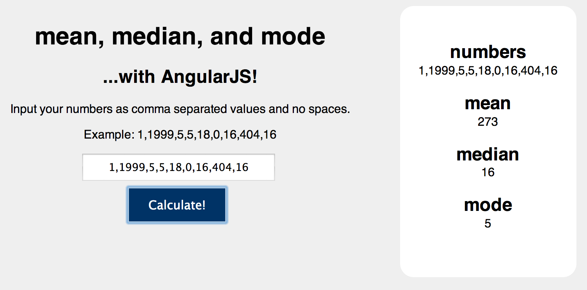

sea-b20-day28hw-MeanMedianModeAngularJS
=======================================

[](https://travis-ci.org/MJGrant/https://travis-ci.org/MJGrant/sea-b20-day28hw-MeanMedianModeAngularJS)

Mean Median Mode in AngularJS

To test (or use) type "grunt" into the Command Line and open localhost:3000

Enter numbers as a comma separated list of values, ie:

``` 1,1999,5,5,18,0,16,404,16 ```


